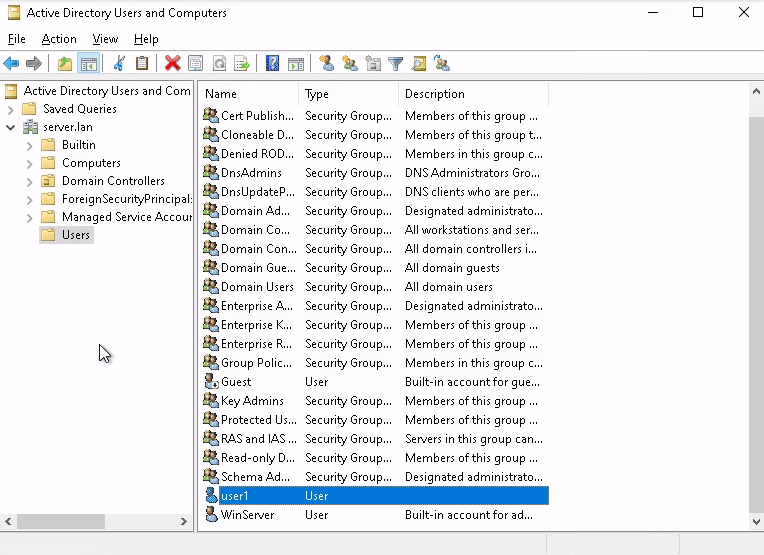

<h1 align="center">:zap: Windows Server :zap:</h1>

- - -

### :large_blue_diamond: **PowerShell**
Note: Done By Reading The Documentation And Learning The Command Line Not A Random Guide On The Internet
##

### :small_orange_diamond:**Change System Name**(restart)
```shell
Rename-Computer -NewName "Sys Name" -restart
```

##

### :small_orange_diamond:**Set timezone**
```shell
Set-TimeZone -Id  'Azores Standard Time'
```

##

### :small_orange_diamond:**Set Network Profile To Private**
```shell
Set-NetConnectionProfile -InterfaceAlias Ethernet -NetworkCategory "Private"
```

##

### :small_orange_diamond:**Configure The Network**
```shell
Netsh interface ip set address "Ethernet" static "ipaddr" "mask" "gateway"
```
```shell
Netsh interface ip add dns "Ethernet" "ipaddr"
```
```shell
Netsh interface ip add dns "Ethernet" "ipaddr" index=2
```

##

- - -

### :large_blue_diamond: **GUI**

##

### :small_orange_diamond:**Set Network To Private**

**Settings -> Network & Internet -> Ethernet -> Network -> Private**


##

### :small_orange_diamond:**Set Network IPs**
**Windows Key + R -> ncpa.cpl & Enter -> Right Click The Network Adapter & Go To Properties -> Properties -> Double Click 'Internet Protocol Version 4(TCP/IPV4)' -> Use The Following IP Adress**


##

### :small_orange_diamond:Install Active Directory
**Manage -> Add Roles and Features -> (Before You Begin)Next -> (Install Type )Role-Based -> (Server Selection)Next -> (Server Roles)Select 'Active Directory Domain Services' & Next -> (Features)Next -> (Confirmation)Next -> (Results)Install & \Wait**


##

### :small_orange_diamond:Promote Server to Domain Controler
**Notifications -> Promote this Server to a Domain Controler**


##

### :small_orange_diamond:Create User
**Tools -> Active Directory Users and Computers**


##

### :small_orange_diamond:Set LogOn Hours
**Tools -> Active Directory Users and Computers -> (User Properties)**




---
